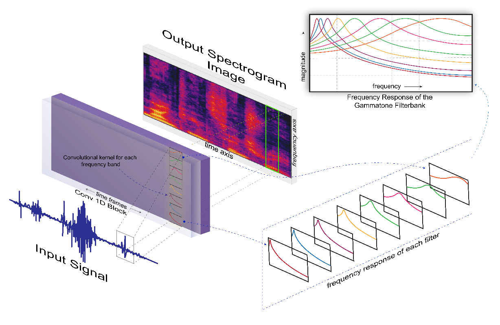

# Adversarial Heart Sound Classification

Pattern recognition from audio signals is an active research topic encompass-
ing audio tagging, acoustic scene classification, music classification, and other
areas. Spectrogram and mel-frequency cepstral coefficients (MFCC) are among
the most commonly used features for audio signal analysis and classification. Re-
cently, deep convolutional neural networks (CNN) have been successfully used
for audio classification problems using spectrogram-based 2D features. In this
paper, we present SpectNet, an integrated front-end layer that extracts spec-
trogram features within a CNN architecture that can be used for audio pattern
recognition tasks. The front-end layer utilizes learnable gammatone filters that
are initialized using mel-scale filters. The proposed layer outputs a 2D spectro-
gram image which can be fed into a 2D CNN for classification. The parameters
of the entire network, including the front-end filterbank, can be updated via
back-propagation. This training scheme allows for fine-tuning the spectrogram-
image features according to the target audio dataset. The proposed method is
evaluated in two different audio signal classification tasks: heart sound anomaly
detection and acoustic scene classification. The proposed method shows a sig-
nificant 1.02% improvement in MACC for the heart sound classification task
and 2.11% improvement in accuracy for the acoustic scene classification task
compared to the classical spectrogram image features

# The Proposed  front-end layer - learnable filterbank
The front-end layers provides control over the number of filterbanks, range of frequnecy of the signal domain and the order of the filters. 
The layers can be found in [this](codes/HeartCepTorch.py). The MFCC_gen module generates MFCC features using a Convolutional Gammatone

Gpu titan Xp 
Gpu driver 430.50 
Cuda driver 10.1
Cuda runtime library 10.0
Cudnn library 7.4.1
Cudnn conda 7.6.1 (came with tensorflow-gpu)
tensorflow 1.13.1

